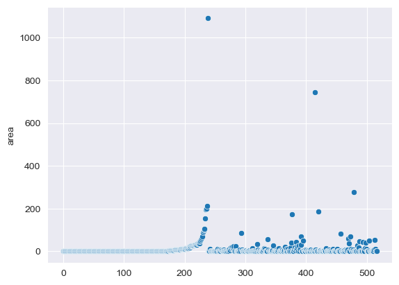
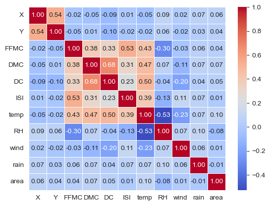

# Burned Areas by Forest Fires Modeling

# 1. Data
The current project aims to model a projection of the burned area by forest fires in a northeast area in Portugal using metereological and environmental data provided by the following source: https://archive.ics.uci.edu/dataset/162/forest+fires

# 2. Method
Our main goal was to predict the burned area by forest fires while using Linear Regression to model the data set. 

# 3. Cleaning and Data Wrangling
The first step we needed to take was to verify that our data did not have any null values. Secondly we needed to drop columns that were not deemed useful for our analysis such as the "day" column which could create too much noise for our modeling.

We however decided to keep the "month" column to take into account seasonality. We then converted the categorical variable into indicator variables to be able to analyse this seasonality into our model.
# 4. EDA
One interesting fact about our data is that our target demonstrates great ammounts of 0.0 values creating a big ammount of outliers. 

()

As we can still pre process the data we decided to take a further look into potential correlations between the variables. We could find that area had a greater positive correlation to area burned than the other variables.

